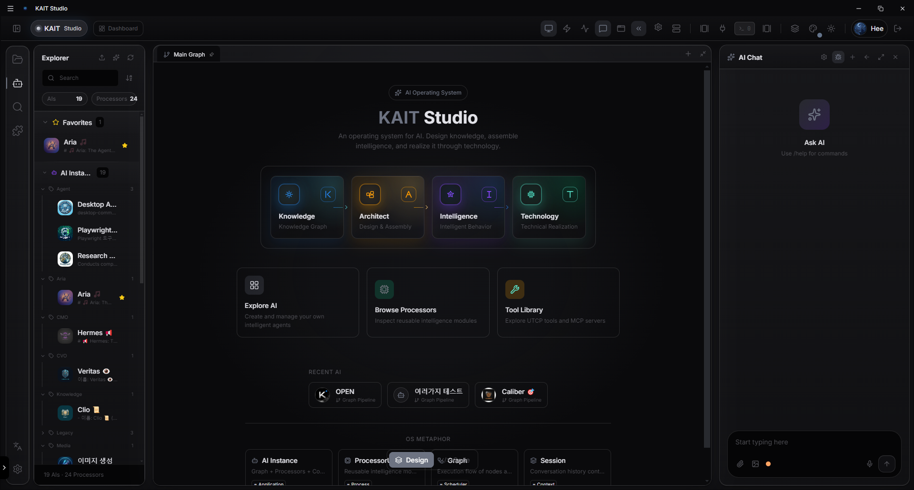

# KAIT OS Architecture Showcase
*(Knowledge Architect Intelligence Technology)*

## Overview
KAIT OS는 단순한 LLM 래퍼(Wrapper)가 아닌, 레거시 시스템과 AI 에이전트를 통합하여 예측 가능한 비즈니스 워크플로우를 구성하는 **엔터프라이즈 다중 에이전트 운영체제(Multi-Agent OS)**입니다.

## Key Features
- **Universal Tool Calling Protocol (UTCP):** 파편화된 기업 API를 단일 규격으로 추상화하여 AI 도구 생태계로 통합
- **Graph Orchestration & Execution State:** 장기 실행(Long-running) 비동기 엔진. 노드 단위 영구 상태 추적을 통한 자율 에러 복구 및 재시작 지원
- **Human-in-the-Loop (HITL) Native:** 중요 인프라 접근 및 위험 작업 시 관리자 승인을 강제하는 보안 통제
- **Multi-Tenant MCP:** 권한 정책 기반 도구 실행 제어 및 테넌트(부서/고객) 격리

## Core Architecture Detail
본 저장소의 핵심 아키텍처 설계 사상은 아래 문서를 통해 확인하실 수 있습니다. (코어 소스코드는 B2B 라이선스 보호를 위해 Private으로 관리됩니다.)
👉 [KAIT_OS_MAIN_ARCHITECTURE.md](./KAIT_OS_MAIN_ARCHITECTURE.md)
