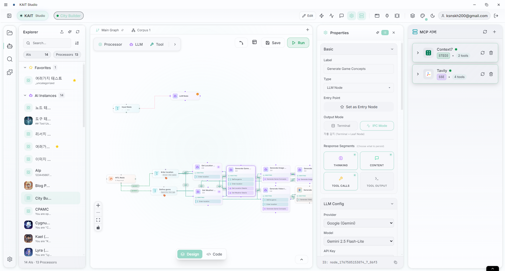
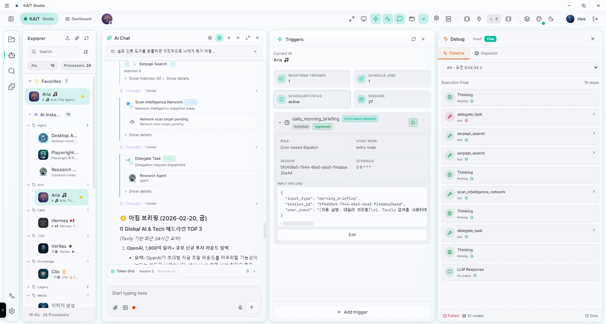

# KAIT OS: Enterprise AI Orchestration Platform
> 기업의 레거시 시스템과 다중 AI 에이전트를 완벽히 통합하는 독자적 AI 운영체제

## 🚀 Why KAIT OS?
현재 많은 기업들이 B2C용 챗봇 프레임워크(LangChain 등)를 엔터프라이즈 환경에 억지로 끼워 맞추려다 **보안 통제 실패, 상태 유실, 레거시 연동의 한계**에 부딪히고 있습니다. 

KAIT OS는 이 문제를 해결하기 위해 **Layer 0부터 5까지 완전히 밑바닥부터 재설계된 다중 에이전트 오케스트레이션 엔진**입니다. AI는 단순한 텍스트 생성기가 아니라, 낡은 API를 쥐고 스스로 워크플로우를 완수하는 **시스템의 지휘자(Orchestrator)**가 됩니다.

---

## 💡 Core Capabilities (UI Showcase)

### 1. Visual Graph Orchestration & MCP Integration

복잡한 비즈니스 로직을 파이썬 코드가 아닌 **노드 기반 그래프(Layer 2)**로 시각적 설계합니다. 
- **Universal Tool Calling Protocol (UTCP):** 사내 레거시 API부터 최신 MCP(Model Context Protocol) 서버까지, 모든 이기종 도구를 단일 규격으로 추상화하여 AI에게 쥐여줍니다.
- **Multi-Tenant Isolation:** 부서별, 고객별로 실행 환경과 접근 가능한 도구를 완벽히 격리합니다.

### 2. Autonomous Execution & State Tracking

단순한 1회성 API 호출이 아닙니다. KAIT는 에이전트가 다른 에이전트에게 작업을 위임하고 결과를 기다리는 **비동기 장기 실행(Long-running) 워크플로우**를 지원합니다.
- **Execution State (Layer 2.5):** AI의 모든 사고 과정(Thinking)과 도구 호출(Tool Calls)을 노드 단위로 영구 추적합니다. 서버가 재시작되어도 에러가 발생한 노드부터 즉시 자율 복구(Resume)합니다.
- **Event & Cron Triggers:** 사람이 묻지 않아도 조건이 충족되거나 정해진 시간에 AI가 스스로 깨어나 작업을 수행하고 보고서를 브리핑합니다.

---

## 🔒 Security: Human-in-the-Loop (HITL) Native
엔터프라이즈 환경에서 AI의 "통제 불능"은 재앙입니다. KAIT OS는 아키텍처 레벨에서 **HITL(관리자 승인 대기)** 기능을 네이티브로 지원합니다.
DB 삭제, 결제 승인, 외부 메일 발송 등 위험한 UTCP 도구가 호출될 경우, AI는 즉시 실행을 멈추고 대기 토큰을 발급하여 관리자의 승인을 기다립니다.

---

## ⚙️ Core Architecture
KAIT OS의 기반이 되는 Layer 0 ~ Layer 5의 핵심 아키텍처 설계 사상은 아래 문서에서 확인하실 수 있습니다.
👉 **[CORE_ARCHITECTURE.md](./CORE_ARCHITECTURE.md)**

*(주의: 코어 소스코드는 B2B 라이선스 및 지식재산권 보호를 위해 Private Repository로 관리 중입니다. 기술 미팅 시 라이브 화면 공유를 통해 코드 워크스루(Code Walkthrough)가 가능합니다.)*
